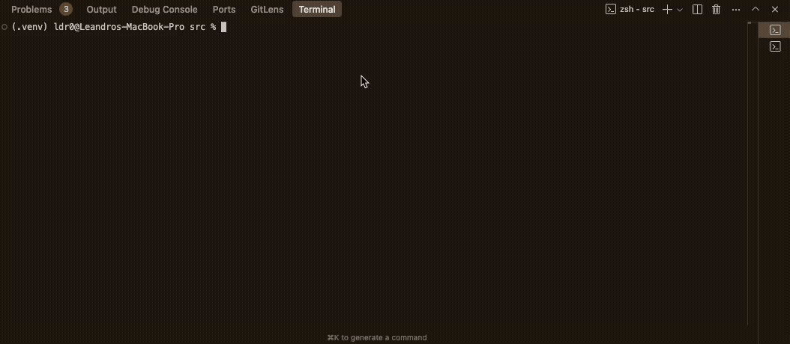

# Comparing ResNet and Vision Transformers: Supervised vs Semi-Supervised Learning for Pet Breed Classification

This project explores and compares the performance of ResNet and Vision Transformer (ViT) architectures for pet breed classification using the Oxford-IIIT Pet Dataset. It examines both fully supervised and semi-supervised learning approaches, including strategies for handling class imbalance.

## Documentation

For detailed methodology, experimental results, and analysis, see our final report: [`report/ID2424___Deep_Learning_Project.pdf`](report/ID2424___Deep_Learning_Project.pdf)

## Demo Video

The following video demonstrates the execution of our main experiment script and showcases the model training and evaluation process:




## Project Structure

```
kth-DD2424-project/
├── data/                           # Data (intended for local storage or .gitignore)
│   └── raw/                        # Original Oxford-IIIT Pet Dataset (images & annotations)
├── models/                         # Saved model checkpoints (structure defined by .gitkeep, content ignored)
│   ├── resnet/
│   │   ├── binary/
│   │   └── multiclass/
│   └── vit/
│       ├── binary/
│       └── multiclass/
├── evaluation/                     # Evaluation artifacts (structure defined by .gitkeep, content mostly ignored)
│   ├── all_evaluations.csv         # Aggregated evaluation metrics (tracked by Git)
│   ├── resnet/
│   │   ├── binary/
│   │   │   └── <model_run_specific_folder>/ # Plots, detailed metrics for a run
│   │   └── multiclass/
│   │       └── <model_run_specific_folder>/
│   └── vit/
│       ├── binary/
│       │   └── <model_run_specific_folder>/
│       └── multiclass/
│           └── <model_run_specific_folder>/
├── src/                            # Source code
│   ├── models/                     # Model definitions (resnet.py, vit.py)
│   ├── dataset.py                  # Dataset loading and preprocessing
│   ├── trainer.py                  # Model training logic
│   ├── evaluation.py               # Model evaluation, plotting, and CSV logging
│   ├── utils.py                    # Utility functions
│   └── main.py                     # Command-line interface for experiments
└── requirements.txt                # Project dependencies
```

## Setup and Installation

1.  **Clone the repository**:
    ```bash
    git clone <your-repository-url>
    cd kth-DD2424-project
    ```
2.  **Create and activate a virtual environment** (recommended):
    ```bash
    python3 -m venv .venv
    source .venv/bin/activate  # On Windows: .venv\Scripts\activate
    ```
3.  **Install dependencies**:
    ```bash
    pip install -r requirements.txt
    ```
4.  **Download the Oxford-IIIT Pet Dataset**:
    *   Create the directory: `mkdir -p data/raw`
    *   Navigate to it: `cd data/raw`
    *   Download the images and annotations:
        ```bash
        wget http://www.robots.ox.ac.uk/~vgg/data/pets/data/images.tar.gz
        wget http://www.robots.ox.ac.uk/~vgg/data/pets/data/annotations.tar.gz
        ```
    *   Extract them:
        ```bash
        tar -xzvf images.tar.gz
        tar -xzvf annotations.tar.gz
        ```
    *   The `data/raw` directory should now contain `images/` and `annotations/`.
    *   Navigate back to the project root: `cd ../..`

## Running Experiments

Experiments are run via the command-line interface:

```bash
cd src
python main.py
```

The script will present a menu of available experiments, including:
*   ResNet50 and ViT binary classification (Dog vs. Cat)
*   ResNet50 and ViT multi-class classification (37 Breeds)
*   Supervised and Semi-supervised training options
*   Experiments with imbalanced datasets and strategies to handle them (e.g., weighted loss, oversampling)

Follow the prompts to configure and run the desired experiment. Trained models are saved in the `models/` directory, and detailed evaluation outputs (plots, metrics) are saved in the `evaluation/` directory, with a summary appended to `evaluation/all_evaluations.csv`.

## Implemented Features

*   **Models**: ResNet50 and Vision Transformer (ViT) architectures.
*   **Learning Approaches**:
    *   Fully supervised learning.
    *   Semi-supervised learning (pseudo-labeling).
*   **Classification Tasks**:
    *   Binary (Cat vs. Dog).
    *   Multi-class (37 pet breeds).
*   **Data Handling**:
    *   Oxford-IIIT Pet Dataset loading and preprocessing.
    *   Data augmentation options for ResNet.
    *   Specific preprocessing for ViT using Hugging Face `AutoImageProcessor`.
    *   Handling of imbalanced datasets (weighted loss, oversampling).
*   **Training**:
    *   Flexible model training with options for learning rates, schedulers, epochs, layer freezing/unfreezing (including gradual unfreezing for ResNet).
    *   Batch Normalization fine-tuning control.
    *   Gradient monitoring.
*   **Evaluation**:
    *   Comprehensive evaluation script (`evaluation.py`).
    *   Generates classification reports, confusion matrices, ROC curves, PR curves.
    *   Saves individual evaluation run artifacts (plots, JSON metrics) to unique folders.
    *   Appends key metrics to a global CSV (`evaluation/all_evaluations.csv`) for comparison.
*   **User Interface**: Interactive command-line menu in `main.py` to select and configure experiments.

## Running on Google Cloud VM

This section outlines how to set up and run the project on a Google Cloud VM.

**1. Local Machine Setup (One-Time)**

*   **Install Google Cloud SDK (`gcloud` CLI)**: Follow the official Google Cloud documentation: [Install the Google Cloud CLI](https://cloud.google.com/sdk/docs/install).
*   **Initialize and Configure `gcloud`**:
    ```bash
    gcloud init
    ```
    *   Log in with the Google account that has access to the GCP project.
    *   Select the correct GCP project ID when prompted.
    *   Configure a default Compute Region and Zone (e.g., `asia-east1` and `asia-east1-c`).

**2. VM Setup & Running Code**

*   **Connect to the VM via SSH**:
    ```bash
    gcloud compute ssh YOUR_VM_NAME --zone=YOUR_VM_ZONE
    ```
    (Replace `YOUR_VM_NAME` and `YOUR_VM_ZONE` accordingly).

*   **Clone Your Project Repository**:
    *   Inside the VM, clone your Git repository:
        ```bash
        git clone <your-repository-url>
        cd kth-DD2424-project  # Or your project's directory name
        ```

*   **Download Dataset on VM**:
    *   Create the necessary directory structure:
        ```bash
        mkdir -p data/raw
        cd data/raw
        ```
    *   Download and extract the dataset:
        ```bash
        wget http://www.robots.ox.ac.uk/~vgg/data/pets/data/images.tar.gz
        wget http://www.robots.ox.ac.uk/~vgg/data/pets/data/annotations.tar.gz
        tar -xzvf images.tar.gz
        tar -xzvf annotations.tar.gz
        cd ../.. # Navigate back to the project root
        ```

*   **Setup Python Environment**:
    *   Create a Python virtual environment:
        ```bash
        python3 -m venv .venv
        ```
    *   Activate it:
        ```bash
        source .venv/bin/activate
        ```
    *   Install dependencies:
        ```bash
        pip install -r requirements.txt
        ```

*   **Run Your Code**:
    *   Navigate to your source code directory (e.g., `cd src`).
    *   Execute your main script:
        ```bash
        python main.py
        ```
    *   Follow the prompts as you would locally.

**3. Updating Code on VM**

*   Connect to the VM via SSH.
*   Navigate to your project directory: `cd ~/kth-DD2424-project` (or your project's directory name).
*   Pull the latest changes from your repository:
    ```bash
    git pull
    ```
*   If `requirements.txt` has changed, reinstall dependencies:
    ```bash
    source .venv/bin/activate # if not already active
    pip install -r requirements.txt
    ```

**Important Notes for VM Usage**:
*   **Exiting the VM**: Type `exit` in the VM's terminal.
*   **Stopping the VM**: Coordinate with your team to **stop the VM** from the Google Cloud Console (Compute Engine > VM Instances) when not in use to manage costs, especially for GPU-enabled VMs.

## Team

- Francesco Olivieri
- Inês Mesquita
- Leandro Duarte


[](https://deepwiki.com/Leandr0Duar7e/kth-DD2424-project)

KTH Royal Institute of Technology, DD2424 Deep Learning in Data Science
